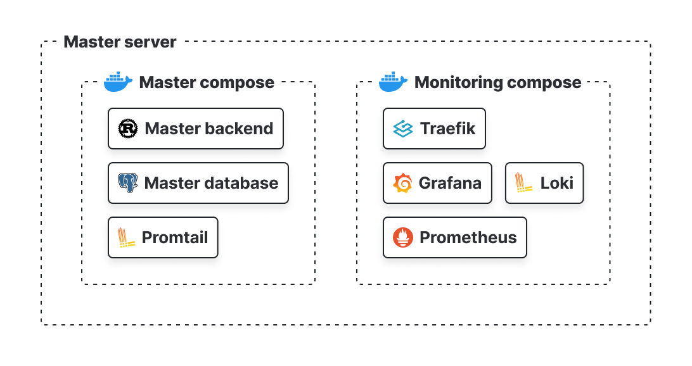

# Мастер Сервер

## Введение

Мастер сервер - это сервер, который отвечает за бизнес логику продукта. Он управляет всеми другими серверами в системе и содержит в себе два докер 
компоуза: **Master compose** и **Monitoring compose**.

:::info 
Да, их можно объединить в один компоуз, однако для будущего масштабирования и удобства разработки, мы решили разделить их. Так же эти компоузы могут быть
развернуты на разных серверах, но в таком случае придется добавить **Traefik** на каждый из них (т.к мы не хотим открывать порты для внешнего доступа, а давать доступ 
только через reverese proxy и SSL).
:::

:::danger
Для корректного сбора логов, необходимо установить **Promtail** на каждом сервере, где запущен сервис, который хотим мониторить. А так же установить Loki plugin на каждом сервисе. 
:::