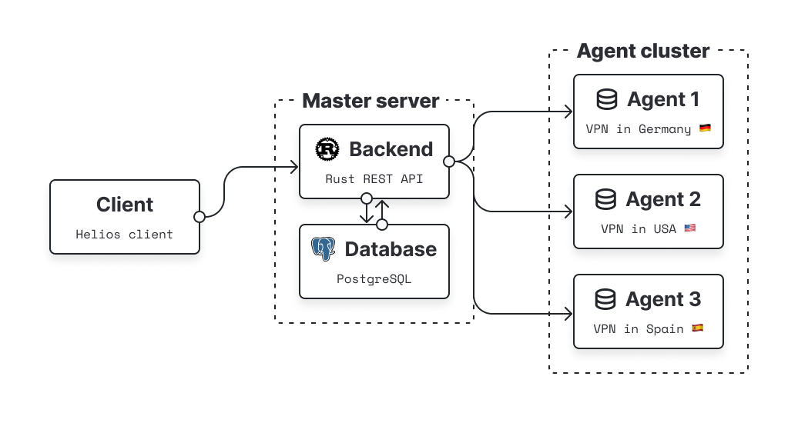
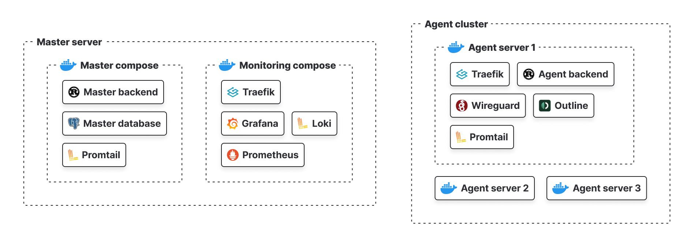
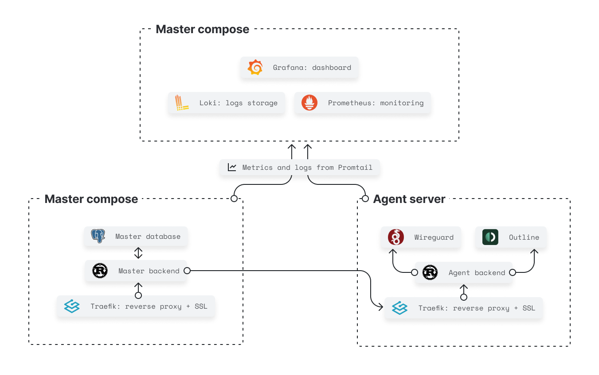

# Обзор архитектуры

## Верхнеуровневая архитектура

Верхнеуровневая архитектура состоит из:

- **Client** - это приложение, которое используется пользователями для взаимодействия с платформой. Helios Client это нативное приложение для мобильных устройств
на базе Android и iOS, десктопное приложение для Windows, macOS и Linux.
- **[Master Server](./master_server)** - это сервер, который управляет всеми другими серверами в системе. Он отвечает за управление пользователями, сессиями, хранение данных и другие важные функции.
 Он содержит:
    - **Backend** - rust REST API сервер, который обрабатывает запросы от клиентов и взаимодействует с базой данных. Так же взаимодействует с агентами для создания конфигураций
    и управления ими.
    - **Database** - это хранилище данных, которое используется для хранения информации о пользователях, конфигурациях, сессиях и других данных.
- **Agent Cluster** - это кластер серверов, которые находятся в разных странах и регионах. Они выступают в роли VPN серверов.
    - **Agent server** - это сервер, который обрабатывает трафик от клиентов и перенаправляет его на нужный адрес. Он также отвечает за шифрование и дешифрование трафика, а так же
    генерацию конфигураций для клиентов.

## Устройство компоузов

:::tip Серверы
**Master compose** и **Monitoring compose** поднимаются на серверах, которые находятся в облаке, либо на одном сервере. 
**Agent compose** поднимается на агент серверах, которые находятся в разных странах и регионах.
:::

Выделим 3 основных комоуза:
- **Master compose** - это композ, который содержит в себе все сервисы, которые относятся к бизнес логике продукта:
    - **Backend** - rust REST API сервер
    - **Database** - PostgreSQL база данных
    - **Promtail** - сервис для сбора логов
- **Monitoring compose** - это компоуз, который содержит в себе сервисы для мониторинга и логирования:
    - **Prometheus** - сервис для сбора метрик
    - **Grafana** - сервис для визуализации данных
    - **Loki** - сервис для хранения логов
    - **Traefik** - сервис для маршрутизации трафика, так же выступает в роли SSL провайдера
- **Agent compose** - поднимается на каждом агент сервере и содержит в себе сервисы для обработки трафика:
    - **Traefik**
    - **Agent backend** - rust REST API сервер, который взаимподействует с впн протоколами и генерирует конфигурации для клиентов
    - **Wireguard** - VPN провайдер
    - **Outline** - VPN провайдер
    - **Promtail**

## Взаимодействие между компонентами

На всех серверах, поднимается **Traefik**, который отвечает за маршрутизацию трафика и выступает в роли SSL провайдера. 
То есть мы обеспечиваем безопасное соединение между клиентом и сервером, а так же повышаем удобство запросов благодаря доменным именам.

Проследим за событиями, которые происходят при подключении клиента к VPN серверу:

1. Клиент отправляет запрос на доменное имя сервера.
2. **Traefik** на сервере принимает запрос и перенаправляет его на **Master backend**.
3. **Master backend** обрабатывает запрос и взаимодействует с **Database** для получения информации о пользователе.
    - Если есть свободные конфиги, то **Master backend** отправляет конфигурацию клиенту.
4. **Master backend** отправляет запрос на **Agent backend** для генерации конфигурации.
5. **Agent backend** взаимодействует с VPN провайдерами и генерирует конфигурацию.
6. **Agent backend** отправляет конфигурацию на **Master backend**.
7. **Master backend** сохраняет конфигурацию в **Database** и отправляет ее клиенту.

:::info Логи и Метрики
В каждом компоузе стоит **Loki** плагин и **Promtail**, которые собирают логи и отправляют их в **Loki**. Так же в каждом компоузе на необходимых сервисах есть **Prometheus** endpoint, 
который собирает метрики и отправляет их в **Prometheus** из **Monitoring compose**.

Затем **Grafana** использует **Prometheus** и **Loki** для визуализации данных.
:::
